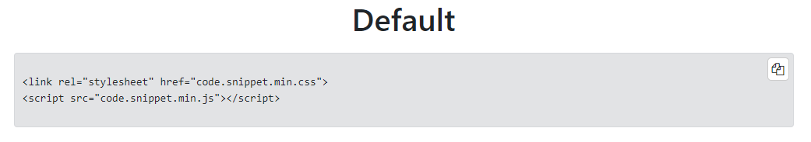
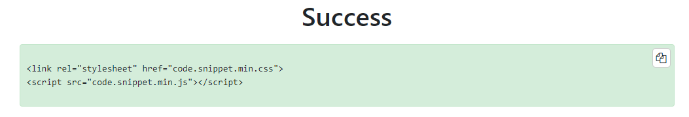
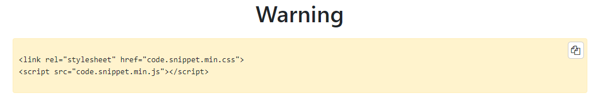
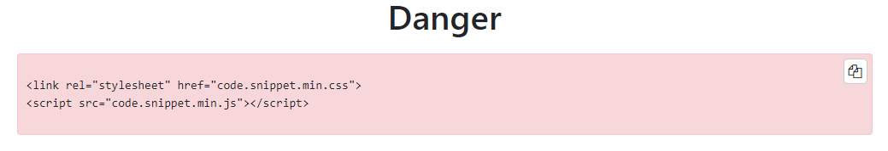
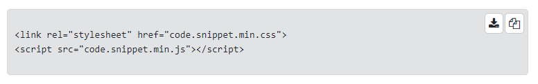

# CodeSnippet
Pequeña libreria/complemento para insertar fragmentos de código en cualquier parte de tu página HTML.

_Small library/plugin to insert code snippets anywhere on your HTML page._


## Requirements ⚙️
Requisitos necesarios para el correcto funcionamiento. Tu página debe disponer de los siguientes elementos.

_Necessary requirements for proper operation. Your page must have the following elements._

* [jQuery](https://code.jquery.com/) - Download link
* [FontAwesome](https://fontawesome.com/v4.7.0/get-started/) - Download link
* [CSS](minified/ccode.snippet.min.css) - CSS CodeSnippet
* [JS](minified/ccode.snippet.min.js) - JS CodeSnippet


A continuación se muestra una tabla de contenidos con las versiones mínimas de los navegadores en los que se pueden insertar estos bloques o fragmentos de código.

_Below is a table of contents with the minimum versions of the browsers in which these blocks or code snippets can be inserted._

|                 | jQuery  | FontAwesome | Chrome | Firefox  | Opera | Safari | IE | Edge |
|-----------------|---------|-------------|--------|----------|-------|--------|----|------|
| Minimum version | v1.12.4 | v4.7.0      | 14     | 20       | 15    | 10.1   |🚫  | 13   |

_Versions from [caniuse.com](https://caniuse.com/)_


## How to embed 🔧
Lo primero de todo tendrás que incluir tanto el JS como el CSS de _CodeSnippet_ en tu página HTML.

_First of all you will have to include both the JS and the CSS of _CodeSnippet_ in your HTML page._
```
<!-- inside <head> -->
<link rel="stylesheet" href="ccode.snippet.css">
<script src="ccode.snippet.js"></script>
```

También está disponible la versión minificada, archivos [aquí](minified/).

_The minified version is also available, files [here](minified/)._


Para insertar un fragmento de código tan solo deberás incluir el esqueleto mostrado a continuación:

_To insert a code snippet, you just have to include the skeleton shown below:_

```
<!-- inside <body> -->
<div class="html-code-snippet [success|warning|danger] [copy|downlaod]">
    your code snippet here
</div>
```

También podrás crear alterar los estilos para diferentes ocasiones, advirtiendo de código bueno (success), código erróneo (danger) y código con el que tener cuidado (warning).

_You can also create alter the styles for different occasions, warning of good code (success), bad code (danger) and code to be careful with._

---

Existen 2 tipos de acciones, copiar al portapapeles o descargar. Para ello añade simplemente las siguientes clases en función de las acciones que quiera incluir en tu ejemplo.

_There are 2 types of actions, copy to clipboard or download. To do this, simply add the following classes depending on the actions you want to include in your example._

---

Para descargar un archivo en el formato adecuado al lenguaje de programación que estés mostrando como ejemplo, tan solo debes incluir la clase "download-[X]" donde "X" es extensión del archivo de cada lenguaje. Algunos ejemplos:

_To download a file in the proper format for the programming language shown as an example, you just have to include the class "download- [X]" where "X" is the file extension of each language. Some examples:_

| HTML Clase/Class        | Archivo/File |
|-------------------------|--------------|
| .download               | .txt         |
| .download.download-c    | .c           |
| .download.download-js   | .js          |
| .download.download-cpp  | .cpp         |
| .download.download-css  | .css         |
| .download.download-php  | .php         |
| .download.download-html | .html        |
| .download.download-[x]  | .[x]         |


¡Podrás jugar con cualquier extensión!

_¡Podrás jugar con cualquier extensión!_

Download files [here](minified/).


## Examples 📦











## Status and version 🚀
Status: _first release_ ✅

Version: _v1.5.0_


---
⌨️ with ❤️ by [csegundo](https://github.com/csegundo) 😊
